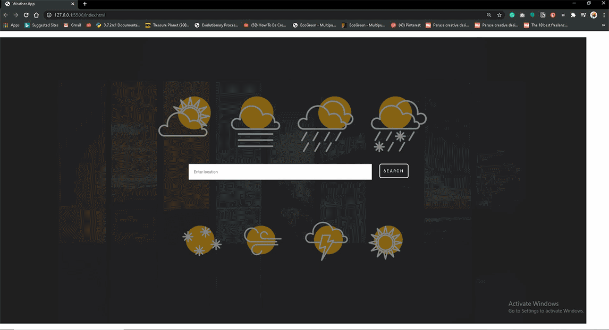
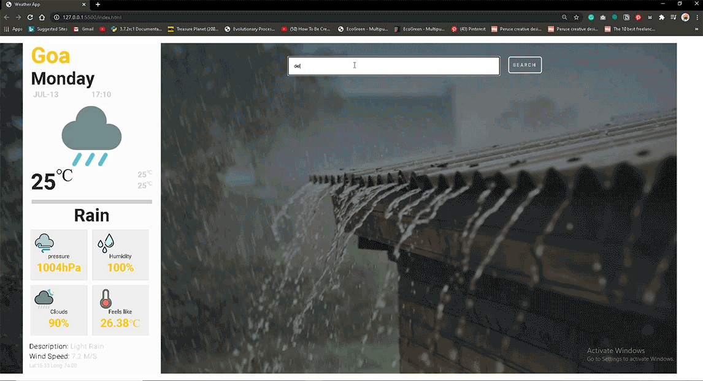
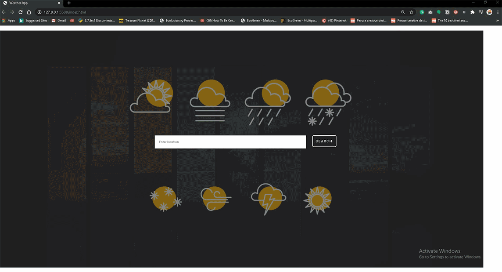

# weatherApp

weather application using Angularjs

[https://balamurugan213.github.io/weatherApp/](https://balamurugan213.github.io/weatherApp/)

***

### This Weather Application is non server based application getting data from the OpenWeather api as a json object.

## Calling OpenweatherApi

```javascript
$http
.get(
    'https://api.openweathermap.org/data/2.5/weather?q=' +
        $scope.city +
        '&units=metric&appid={ENTER YOUR API-ID HERE}'
)
.then(
    function(dat){
        // responce for success
        ....
    },
    function(){
        // responce for failure
        ....
    }
)
```

## Output




## when input is wrong


## Responsiv using media query
